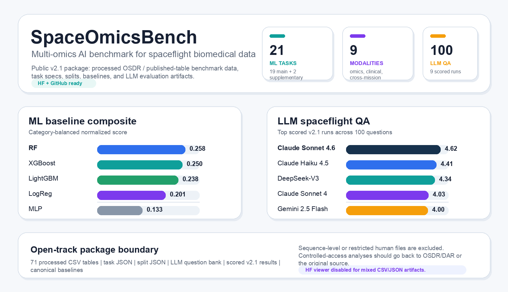

# SpaceOmicsBench

A multi-omics AI benchmark for spaceflight biomedical data, featuring **21 ML tasks** across **9 modalities** and a **100-question LLM evaluation** framework.

Data sources: SpaceX Inspiration4 (I4) civilian astronaut mission, NASA Twins Study, and JAXA Cell-Free Epigenome (CFE) study. All benchmark tables are derived from OSDR public releases and/or published supplementary tables.

Maintainer / citation author: **JangKeun Kim**, Weill Cornell Medicine.

[](https://github.com/jang1563/SpaceOmicsBench)
[](https://jang1563.github.io/SpaceOmicsBench/llm_leaderboard.html)



## Dataset Summary

| | |
|---|---|
| **ML Tasks** | 21 tasks (19 main + 2 supplementary) |
| **LLM Evaluation** | 100 questions, 5-dimension Claude-as-judge scoring, 9 models evaluated |
| **Modalities** | Clinical, cfRNA, Proteomics, Metabolomics, Spatial Transcriptomics, Microbiome, Multi-modal, Cross-tissue, Cross-mission |
| **Difficulty Tiers** | Calibration / Standard / Advanced / Frontier |
| **Missions** | Inspiration4 (4 crew, 3 days LEO), NASA Twins (340 days ISS), JAXA CFE (6 astronauts, ISS) |
| **Evaluation Schemes** | Leave-One-Crew-Out, Leave-One-Timepoint-Out, 80/20 feature splits (5 reps) |
| **ML Baselines** | Random, Majority, LogReg, RF, MLP, XGBoost, LightGBM |

The web Dataset Viewer is intentionally disabled (`viewer: false`) because this repository mixes wide benchmark CSV matrices, task/split JSON specifications, and scored LLM result artifacts. Use the **Files and versions** tab or `huggingface_hub` for deterministic access.

## Public Package Boundary

This public dataset package includes only processed, publicly shareable benchmark artifacts:

- `data/processed/`: benchmark CSV tables
- `tasks/`: ML task definitions
- `splits/`: train/test split definitions
- `evaluation/llm/question_bank.json`: 100-question LLM evaluation bank
- `results/v2.1/`: scored LLM evaluation outputs
- `baselines/baseline_results.json`: canonical ML baseline reference

Raw sequencing data and controlled-access human files are **not redistributed**. For controlled-access material, users should obtain access from the original source, such as OSDR DAR, dbGaP, or LSDA.

## Quick Access

```python
from huggingface_hub import hf_hub_download
import json
import pandas as pd

repo_id = "jang1563/SpaceOmicsBench"

task_path = hf_hub_download(repo_id=repo_id, filename="tasks/B1.json", repo_type="dataset")
baseline_path = hf_hub_download(repo_id=repo_id, filename="baselines/baseline_results.json", repo_type="dataset")
table_path = hf_hub_download(repo_id=repo_id, filename="data/processed/cfrna_3group_de_noleak.csv", repo_type="dataset")

task = json.load(open(task_path))
baselines = json.load(open(baseline_path))
table = pd.read_csv(table_path)
```

## Repository Structure

```text
SpaceOmicsBench/
|-- data/processed/        # Benchmark CSV tables
|-- tasks/                 # ML task definitions (JSON, 21 tasks)
|-- splits/                # Train/test splits (JSON)
|-- evaluation/llm/        # LLM question bank and evaluation assets
|-- results/v2.1/          # Scored LLM results (9 models)
|-- baselines/             # ML baseline results
`-- docs/                  # Provenance, citations, and public documentation
```

## LLM Leaderboard (v2.1)

9 models evaluated with Claude Sonnet 4.6 as judge, 5-dimension scoring:

| Rank | Model | Score (1-5) | Factual | Reasoning | Completeness | Uncertainty | Domain |
|:---:|-------|:---:|:---:|:---:|:---:|:---:|:---:|
| 1 | Claude Sonnet 4.6 | **4.62** | 4.65 | 4.97 | 4.77 | 4.09 | 4.33 |
| 2 | Claude Haiku 4.5 | **4.41** | 4.39 | 4.84 | 4.54 | 3.83 | 4.12 |
| 3 | DeepSeek-V3 | **4.34** | 4.40 | 4.75 | 4.39 | 3.71 | 4.11 |
| 4 | Claude Sonnet 4 | **4.03** | 4.28 | 4.47 | 4.07 | 3.14 | 3.74 |
| 5 | Gemini 2.5 Flash | **4.00** | 4.45 | 4.36 | 3.96 | 3.22 | 3.45 |
| 6 | GPT-4o Mini | **3.32** | 3.93 | 3.54 | 3.21 | 2.78 | 2.64 |
| 7 | Llama-3.3-70B (Groq) | **3.31** | 4.03 | 3.52 | 3.21 | 2.61 | 2.57 |
| 8 | Llama-3.3-70B (Together) | **3.31** | 4.00 | 3.50 | 3.20 | 2.65 | 2.62 |
| 9 | GPT-4o | **3.30** | 3.98 | 3.61 | 3.13 | 2.57 | 2.62 |

See full breakdown at the [interactive leaderboard](https://jang1563.github.io/SpaceOmicsBench/llm_leaderboard.html).

## SpaceOmicsBench v3

v3 expands the benchmark with new missions, advanced ML methods, and biomedical-specialized model evaluation. v3 is developed in a separate repository: [SpaceOmicsBench-v3](https://github.com/jang1563/SpaceOmicsBench-v3). All v2 tasks and questions are preserved in v3.

| | v2 | v3 |
|---|---|---|
| **ML Tasks** | 21 (7 baselines) | **26 tasks** (25 leaderboard, 16 methods) |
| **LLM Questions** | 100 (9 modalities) | **270** (12 categories) |
| **LLM Models** | 9 (general-purpose) | **9** (4 general + 5 bio-specialized) |
| **Missions** | I4, JAXA, Twins | + **Axiom-2** Epigenetic |
| **Key ML Results** | LightGBM AUPRC=0.922 (B1) | **TabPFN AUPRC=0.957** |
| **Foundation Models** | ESM2/GNN not included in v2 public package | ESM2, GNN negative results |

## Citation

```bibtex
@misc{kim2026spaceomicsbench,
  title={SpaceOmicsBench: A Multi-Omics AI Benchmark for Spaceflight Biomedical Data},
  author={Kim, JangKeun},
  year={2026},
  url={https://github.com/jang1563/SpaceOmicsBench}
}
```

## License

- **Code** (scripts, evaluation framework, baselines): [MIT License](https://github.com/jang1563/SpaceOmicsBench/blob/main/LICENSE)
- **Benchmark data** (processed tables, task definitions, question bank, scored results): [CC BY-NC 4.0](https://creativecommons.org/licenses/by-nc/4.0/) for academic/research use; commercial use requires a separate license.

Copyright (c) 2026 JangKeun Kim. For commercial licensing inquiries: jak4013@med.cornell.edu
